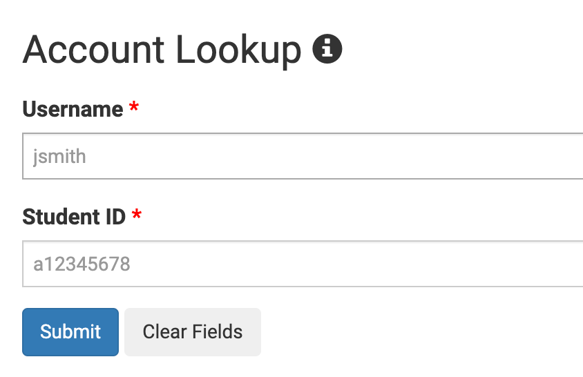
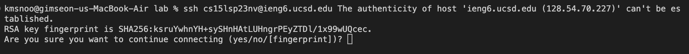
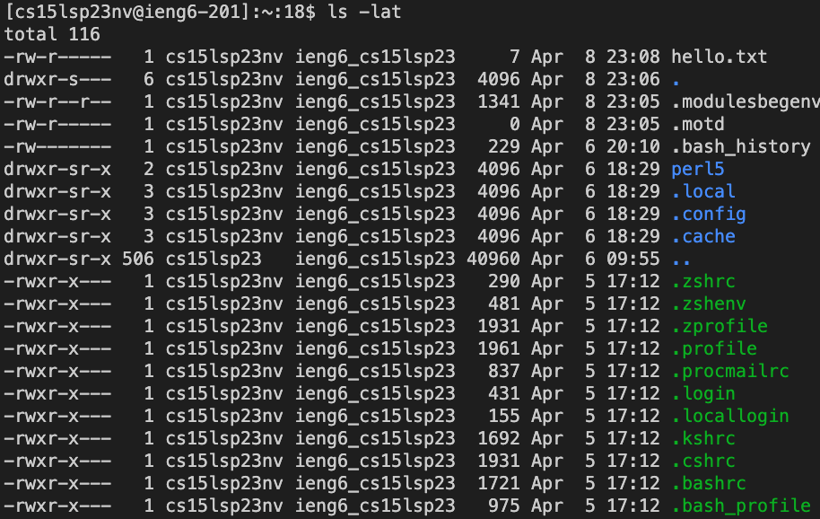
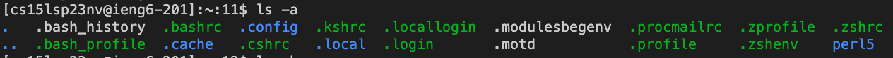
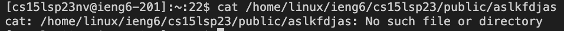
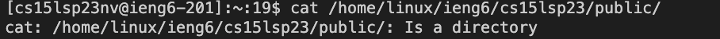

# Brian Kim's Website
---
**Hi, This is my website for CSE15L!** 

--- 
# Downloading VScode: 

> Before we get into the remote connection, we have to download the IDE VScode. 
> If you already have VScode in your computer, you may skip this step. 

**Step 1**
First, go to the Visual Studio Code website --> [here](https://code.visualstudio.com/)

**Step 2**


Go to the download section, and install that matches your computer. 

**Step 3**


When you are done, you will see this screen. Take your time and go through the steps!

**Step 4**


When you see this screen, you are done with your set up. 

# Remotely Connecting: 

## Step 1
> **Make sure you have the necessary credentials to access the remote server. This may include a username, password, and/or SSH key.**

  **Step 1.1: Find your username**
  
  Go to this link --> [here](https://sdacs.ucsd.edu/~icc/index.php) <-- 
  
  In this link, you will find your CSE15L course specific account username.
  
  **Step 1.2: Reset your password**
  
  Now, reset your password. 
  use this **slides** as assistance: [Tutorial](https://drive.google.com/file/d/17IDZn8Qq7Q0RkYMxdiIR0o6HJ3B5YqSW/view)

## Step 2: 
> **Use the SSH command to connect to the remote server.**

**The syntax for this command is as follows:**

   ```
   ssh [username]@[server_address]
   ```

   For example, if your username is "john" and the server address is "example.com", you would enter the following command:

   ```
   ssh john@example.com
   ```
**the server address we will be using is:**
   ```
   ieng6.ucsd.edu
   ```

## Step 3: 
> **If this is your first time connecting to the remote server, you may be prompted to verify the server's authenticity.**

You will see something like: 



Type "yes" to continue connecting. 

## Step 4: 
> **If you are using a password to connect to the remote server, enter it when prompted.**


# Try Some Commands 
> **You are logged in. Now what?**

Once you have successfully authenticated, you will be logged into the remote server's command line interface. You can now execute commands on the remote server as if you were physically present.

Now, let us try some commands.
Here are some specific useful commands to try: 

1. cd ~
2. cd
3. ls -lat

The ls command is a list command. Here, it will list all the contents in the lat directory. 


4. ls -a

Similarly, it will list all the contents in the a directory. 


5. cp /home/linux/ieng6/cs15lsp23/public/hello.txt ~/
6. cat /home/linux/ieng6/cs15lsp23/public/hello.txt

If there is no such directory, it will show something like: 

If it is a directory, it will show something like: 

 
## To disconnect from the remote server, simply type "exit" or "logout" in the terminal.

---
# That's it! With these steps, you should be able to connect remotely to a remote server using SSH.
