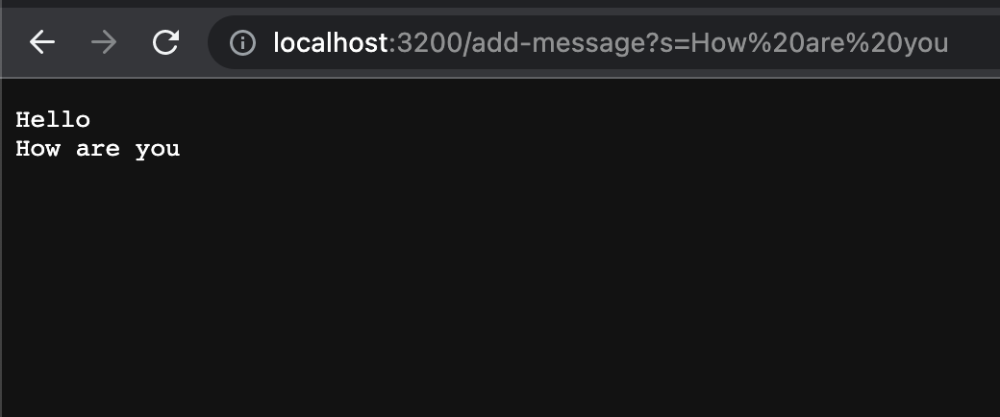

# Lab Report 2

Brian Kim,
A17462905

# Part 1

### This is the code for the StringServer:


### ```/add-message?s=Hello```


### Methods called: 
When you are starting the website, ```start``` method is called. 
When you put ```/add-message?s=Hello``` to the url, the ```handleRequest``` method is called. 
Inside the ```handleRequest``` method, ```getQuery``` and ```getPath``` method is called. 

### Relevant arguments and values in these methods, and any changes: 

1. ```start``` method

The ```start``` method is inside the ```Server``` class, and it is called when the website starts, inside the ```main``` method. The method in the ```Server``` class takes one parameters, port number (```int``` value ranging from 1024 to 49151). The ```start``` method prints the localhost ```url```.

2. ```handleRequest``` method

The ```Handler``` class initiates the ```message``` that start as an empty ```String```. Then, the ```handlerequest``` method in the ```Handler``` class. The method takes the ```URI``` as a parameter, and goes through a nested if statements that checks for conditions that determines the ```message``` that will be displayed on the website. The message is not replaced even though the query in the ```url``` changes, but rather adds the new query to the message.

3. ```getQuery``` and ```getPath``` method

Inside the ```handleRequest``` method that is inside the ```Handler``` class, ```getQuery``` and ```getPath``` method is called. The ```getQuery``` method is a method inside the ```URI``` class that returns the decoded query component of the ```URI```. This means the part that comes after the ```?```. Likewise, the ```getPath``` component also returns the decoded path component of the ```URI```. This means the part that comes from ```/ to ?```.

### ```/add-message?s=How are you```



### Methods called: 
Because we are not starting the website again, ```start``` method is NOT called. 
When you put ```/add-message?s=How are you``` to the url, the ```handleRequest``` method is called. 
Inside the ```handleRequest``` method, ```getQuery``` and ```getPath``` method is called. 

### Relevant arguments and values in these methods, and any changes: 

1. ```start``` Method

Because the website is already running, the ```start``` method is not called again.

2. ```handleRequest``` Method

```handleRequest``` method is again called when i add the ```message``` How are you. The website displays the string ```Hello \n How are you``` because the string ```message``` is not replaced, but **changes** by adding on of the ```Hello``` which existed previously. The ```handleRequest``` takes the updated ```URI```, and by going through nested if statements, it updates the string value ```message```, concatenating it into ```Hello\nHow are you```.

3. ```getQuery``` and ```getPath```

Because the ```handleRequest``` method is called, the ```getQuery``` and ```getPath``` method is also called. Both ```getQuery``` and ```getPath``` methods are methods inside the ```URI``` class that returns a String that contains the query and path. Here, ```getQuery``` returns ```s=How are you``` and ```getPath``` returns ```/add-message```.

# Part 2

1. **Failure Inducing Code**

```
static List<String> filter(List<String> list, StringChecker sc) {
    List<String> result = new ArrayList<>();
    for(String s: list) {
      if(sc.checkString(s)) {
        result.add(0,s);
      }
    }
    return result;
 }
```

```
@Test //Does not pass the test
public void filterTest() {
    StringChecker sc = new StringCheck("a");
    List<String> list = new ArrayList<>();
    list.add(null);
    list.add("b");
    list.add("a");
    List<String> list2 = new ArrayList<>();
    list2.add("b");
    assertEquals(list2, ListExamples.filter(list, sc));
  }
```


As shown in the screenshot above, the test results in ```NullPointerException```. This gives error because the add method does not address the case for a ```null``` element, therefore the code should be fixed so that it addresses the input. The fixed method below should work because it checks for elements in the list that are ```null```. It checks if the list itself is ```null```, and if the ```StringChecker``` element is ```null``` as well.

2. **Fixed Method**

```
static List<String> filter(List<String> list, StringChecker sc) {
    List<String> result = new ArrayList<>();
    if (list == null) {
      return result;
    }
    if (sc == null) {
      return result;
    }
    for(String s: list) {
      if (s == null) {
        continue;
      }
      if(sc.checkString(s)) {
        result.add(s);
      }
    }
    return result;
  }
```

**Now, this would work:**
The fixed code would work because it includes ```null``` checks before accessing elements of the input list or the ```StringChecker``` object. Specifically, it checks if the input is ```null``` and returns an empty list if it is ```null```. In addition, it checks for ```null``` elements in the input list and skips them using the ```continue``` statement, avoiding the ```NullPointerException``` that was previously encountered.  Although not shown in the example test above, the method adds the element to ```index 0``` everytime, which results ```Assertion error``` nonetheless. This part is also changed so that each element is properly added at the end of the list.   

```
@Test //This passes the test
  public void filterTest() {
    StringChecker sc = new StringCheck("a");
    List<String> list = new ArrayList<>();
    list.add(null);
    list.add("b");
    list.add("a");
    List<String> list2 = new ArrayList<>();
    list2.add("b");
    assertEquals(list2, ListExamples.filter(list, sc));
  }
```

# Part 3

> During the second lab, I learned how to connect to the remote server. This was especially valuable to me because this gave me a starting background for backend development. Also, another concept that I found very important was the shortcut `control C`, which cancels or exits the program that is running. In lab 3, I was able to gain a deeper understanding of the nature of debugging. Although I originally thought that `JUnit` was a mere test code, I realized that we could use the `JUnit` tests as a debugging medium by interacting with the tested method back and forth.
