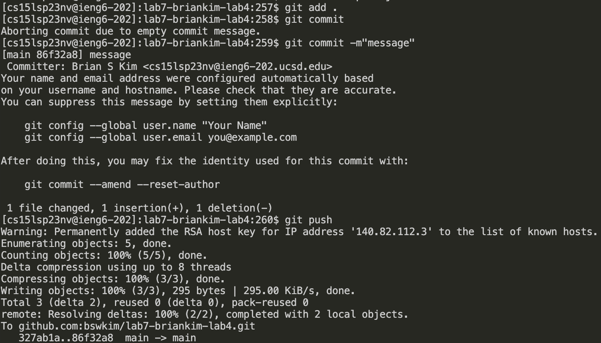

## Log into ieng6 

## Clone your fork of the repository from your Github account

## Run the tests, demonstrating that they fail

## Edit the code file ListExamples.java to fix the failing test (as a reminder, the error in the code is just that index1 is used instead of index2 in the final loop in merge)

## Run the tests, demonstrating that they now succeed

## Commit and push the resulting change to your Github account

