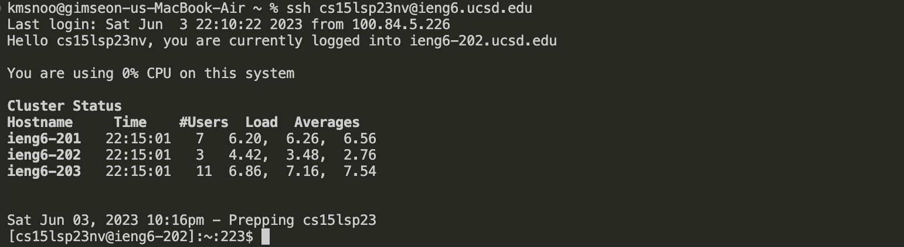

## Log into ieng6 



Keys pressed: ```ssh cs15lsp23nv@ieng6.ucsd.edu <enter>``` Then, ```<Password> <enter>``` to login to the remote cs15lsp account using ssh. 

## Clone your fork of the repository from your Github account


Keys pressed: ```git clone``` after doing that, I pressed ```<command> + <v>``` which is ```https://github.com/bswkim/lab7-lab4demo-briankim.git <enter>```, the https from my github to copy and paste the repo to the remote account. 

## Run the tests, demonstrating that they fail


First, I accessed the lab7-lab4demo-briankim repo using cd. Keys pressed were: ```cd lab7-lab4demo-briankim <enter>```. And then, I pressed ```bash test.sh <enter>``` to run the bash script inside the lab7-lab4demo-briankim. This gives fail, since we should change the word index1 to index2 inside the ListExamples.java file. 

## Edit the code file ListExamples.java to fix the failing test (as a reminder, the error in the code is just that index1 is used instead of index2 in the final loop in merge)


I opened the vim editor using the key: ```vim ListExamples.java <enter>```


Then, I searched for the word ```index1``` using the key: ```/index1 <enter>```. Then, I traversed down to the index1 that I want to change by pressing ```n``` key 6 times. ```n n n n n n```


Now I have to replace the character 1 with 2. To do so, I pressed: ```l l l l l l``` to traverse over to the character 2, pressed ```x``` to delete the character 2, and pressed ```i``` to go to the insert mode followed by ```2``` to change it. In order to exit the insert mode, I pressed ```<esc>```, which brings me to normal mode. 


Because I am done changing the error, I pressed ```:wq <enter> ``` to save and exit the vim editor. 

## Run the tests, demonstrating that they now succeed


Now that I am back to the terminal with the error fixed, I run the test by pressing ```bash test.sh <enter>```. This runs the test, and the result proves that the vim editor change has worked successfully. 

## Commit and push the resulting change to your Github account


With the changed code, I updated the code using git. This was done pressing ```git add . <enter>``` which . at the end means adding all the changes. Then, I commited the added changes using ```git commit -m"success" <enter>```. This commit was then pushed to the github by the key ```git push <enter>```. 
