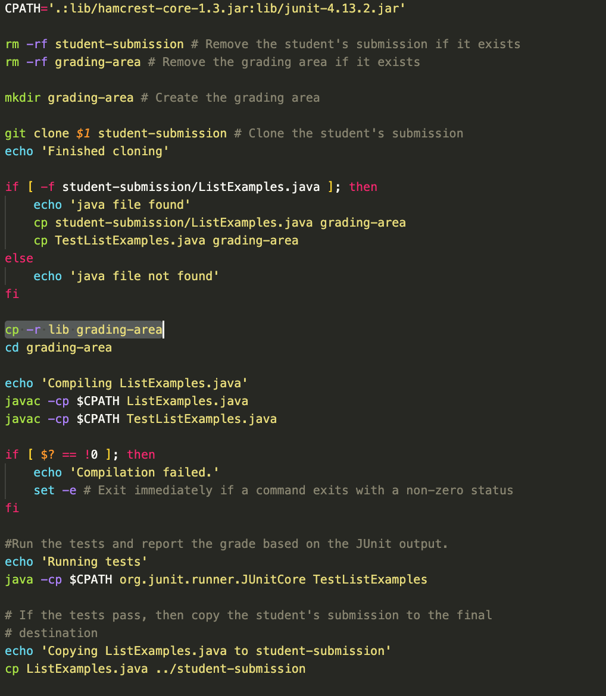

# Lab Report 5
Brian Kim
A17462905

# Student Question: 

## Help with Error: Junit does not exist 
### #286


**What environment are you using (computer, operating system, web browser, terminal/editor, and so on)?**

- VSCode, Google Chrome, MacOS operating system

**Detail the symptom you're seeing. Be specific; include both what you're seeing and what you expected to see instead. Screenshots are great, copy-pasted terminal output is also great. Avoid saying “it doesn't work”.**

I'm encountering an error while running a script, and I could use some help. The error message states that the ```package org.junit``` does not exist. Here are the details of my setup:

I have a script that clones a student's submission, compiles the code, and runs JUnit tests. The script uses ```JUnit version 4.13.2```, and I have the necessary JUnit library files (```junit-4.13.2.jar and hamcrest-core-1.3.jar```) in the lib directory relative to the script.
I keep getting the ```package org.junit``` does not exist error. I have double-checked the JUnit library files, their names, and locations, but I can't seem to figure out why the package is not being found. 


When you see the screenshot above, I am copying the necessary junit packages over to the ```grading-area```, which is where the compilation of junit is done. However, the error states that it is still not found. It seems like it is successfully copied as well: 


Could you please provide guidance on how to resolve this issue? Is there anything else I should check or configure to ensure that the JUnit package is detected during compilation and execution?

**Detail the failure-inducing input and context. That might mean any or all of the command you're running, a test case, command-line arguments, working directory, even the last few commands you ran. Do your best to provide as much context as you can.**

Although I do not think that the java code is the problem, here is the code for ```TestListExamples.java```: 


The command that I used was: 

```bash labgrade.sh https://github.com/ucsd-cse15l-f22/list-methods-corrected```

I don't think it's a problem with student submission as well, because this student submission should pass. 

_________________

# TA's answer: 


Hi there,

Thank you for providing detailed context about the issue you're facing. Let's try to troubleshoot the problem together. Based on the information you've provided, here are few questions to help pinpoint the cause:

1. What exactly is your labgrade.sh trying to compile? It could be found under your comment: ```#Run the tests and report the grade based on the JUnit output.``` 
2. Does that align with what you are copying to the ```grading-area```?

Also, to troubleshoot more effectively, try considering ```echo```ing for each steps. Good luck!

_________________

# Student Response: 


Hello, 

Thank you very much for your answer! 



Before heading into troubleshooting, as what you advised, I tried to echo each step. As I did that, I noticed that the copying (```cp```) of jar files over to ```grading-area``` was the problem. ```CPATH``` is what the labgrade.sh bash script is trying to compile, and that it is different from copying junit pacakages into the ```grading-area```. I realized that the ```CPATH``` directs to a junit package inside the lib folder, and that is why I was getting error. Inside the ```grading-area``` folder, it was essential to have ```lib``` file, not two separate junit files. So, I changed the the part where it used to be:

```
cp lib/hamcrest-core-1.3.jar
cp lib/junit-4.13.2.jar
```

to 

```
cp -r lib grading-area
```

I added the -r option to copy all the files inside the lib folder recursively. 

Here is the command that I tried on the terminal to check if it is working correctly: 
```bash labgrade.sh https://github.com/ucsd-cse15l-f22/list-methods-corrected```

And this was the output:


Thanks!

<p>Reply ...</p>

